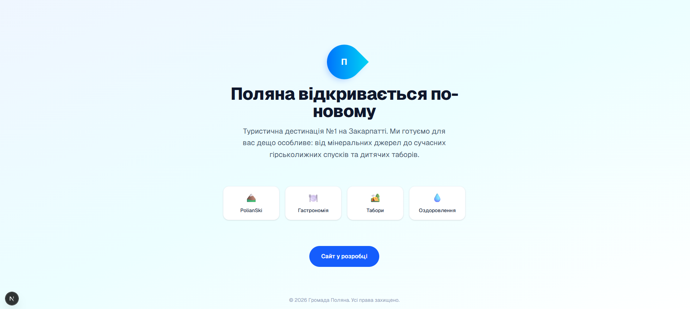

# 💧 Туристичний портал "Поляна-Інфо" (Poliana-Info)

## 📌 Про проект

Комплексна інформаційна та комерційна платформа для розвитку бренду громади Поляна як "Туристичної дестинації №1 на Закарпатті".

**Головна мета:** Змінити позиціонування курорту. Поляна — це більше, ніж просто бальнеологічний курорт і мінеральна вода. Через єдину платформу ми об'єднуємо партнерів (PolianSki, ресторан Катерина та ін.), показуємо нові локації та продаємо комплексні пакети відпочинку.

**Візуальна концепція:** В основі лежить "крапля" мінеральної води, що символізує джерело, від якого розходяться хвилі нових сучасних туристичних продуктів.

---

## 🏗️ Структура веб-сайту

Платформа поєднує функціонал новинного порталу та системи бронювання/продажу турів.

### Основні розділи головної сторінки:

1. **Про громаду Поляна:** Туристична дестинація №1. (Яскраві фото локацій, мінеральні води, бювети).
2. **Де відпочити:** Інтеграція локальних партнерів для утримання користувача на сайті (PolianSki, Катерина та ін.).
3. **Дитячі літні табори:** Огляд усіх таборів громади (включаючи інтеграцію з розширеною платформою для літніх таборів).
4. **Івент-туризм:** Організація випускних та корпоративних заїздів (на базі успішного досвіду роботи з групами).
5. **Наші партнери:** Динамічний каталог партнерів (готелі, гірськолижні витяги, ресторани), що постійно поповнюється.
6. **Що нового в Поляні? (Блог/Новини):** Анонси (веломаршрути, велопрокат, ролердром, сувенірна продукція).

---

## 📱 Маркетингова стратегія та Соцмережі

### Facebook

- **Оформлення:** Тематичний банер, фото профілю у вигляді логотипу-краплі з веб-адресою сайту.
- **Перший пост:** Привітання на сторінці, місія проекту ("будемо інформувати про відпочинок, запрошуємо в Поляну").

### Instagram

- **Оформлення:** Оптимізований опис (біо), фірмове фото профілю.
- **Перший пост:** Яскраве професійне фото локації з детальним описом нових можливостей курорту.

### 🏢 Туристично-інформаційний центр (Офлайн)

Фізичне представництво порталу.

- **Оформлення приміщення:** Брендована стійка, тематичний банер (бренд-волл) позаду.
- **Функціонал:** Куточок із сувенірною продукцією, інста-зона (можливо, дзеркало чи ролап для фотографій туристів).

---

## 💻 Технічний стек (Current)

- **Framework:** Next.js 14 (App Router)
- **Styling:** Tailwind CSS
- **Language:** TypeScript
