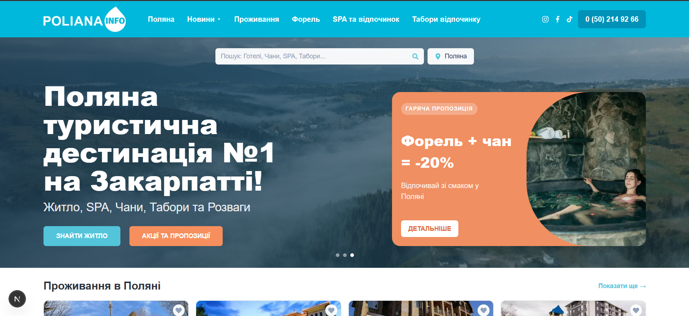

# 💧 Poliana Info

Туристичний портал громади Поляна (Закарпаття): проживання, SPA, табори, новини, карта готелів та FAQ.



## Технології

- `Next.js 16` (App Router)
- `React 19`
- `TypeScript`
- `Tailwind CSS 4`
- `react-icons`
- `@vercel/analytics`

## Запуск локально

1. Встановіть залежності:

```bash
npm install
```

2. Створіть/перевірте `.env.local`:

```env
NEXT_PUBLIC_GOOGLE_MAPS_API_KEY=your_google_maps_key
```

3. Запустіть dev-сервер:

```bash
npm run dev
```

4. Відкрийте `http://localhost:3000`.

## Деплой на Vercel

У `Project Settings -> Environment Variables` обов'язково додайте:

- `NEXT_PUBLIC_GOOGLE_MAPS_API_KEY`

Після додавання змінної зробіть `Redeploy`.

> Якщо ключ відсутній або API не завантажився, на сторінці автоматично показується fallback-карта (`iframe`).

## Основні маршрути

- `/` - головна сторінка
- `/poliana` - інформаційна сторінка "Поляна"
- `/accommodation` - проживання
- `/spa` - SPA та відпочинок
- `/camps` - табори відпочинку
- `/gastronomy` - форель
- `/blog` - новини
- `/blog/latest-news`
- `/blog/poliana-in-spring`
- `/blog/summer-vacation`
- `/blog/autumn-vacation`
- `/blog/poliana-in-winter`

## Карта готелів

На головній сторінці використовується Google Maps JavaScript API з мітками:

- Готель Катерина
- Готель Континент
- River Side Hotel
- Arena Apart-Hotel

Для кожної мітки доступний попап з деталями та переходом у Google Maps.
